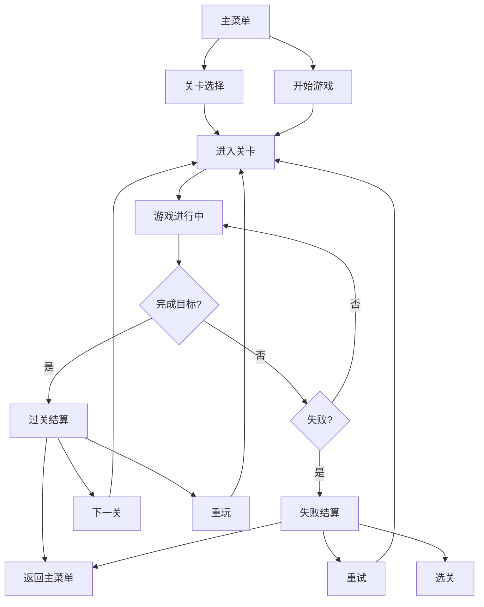

## 1. 产品概述

圆环缺口守球（Ring Gap Keeper）是一款休闲物理网页游戏，玩家通过拖动鼠标控制圆环内的小球，阻止其从缺口逃出。游戏强调物理手感、短局重开的游戏体验，适合碎片化时间娱乐。

- 核心玩法：按住拖动鼠标给球施加切向力，使球在带缺口的圆环内弹跳，阻止球从缺口逃出
- 目标用户：休闲游戏玩家、物理游戏爱好者
- 市场价值：纯前端 SPA，无后端依赖，可 PWA 离线运行，易于传播和部署

## 2. 核心特征

### 2.1 用户角色

| 角色 | 注册方式 | 核心权限 |
|------|----------|----------|
| 玩家 | 无需注册，浏览器单机 | 开始游戏、选择关卡、调整设置、查看最高分 |

### 2.2 功能模块

1. **主菜单**：开始游戏、关卡选择、设置、玩法说明
2. **游戏场景**：圆环、缺口、小球、物理碰撞、拖动控制
3. **HUD 界面**：分数显示、关卡信息、暂停按钮、音效开关
4. **失败层**：本局分数、最高分、重试按钮、选关按钮
5. **关卡系统**：20 关递进难度、顺序解锁
6. **音频系统**：碰撞音效、过关音效、失败音效
7. **存储系统**：最高分、关卡进度、设置持久化

### 2.3 页面详情

| 页面名称 | 模块名称 | 功能描述 |
|----------|----------|----------|
| 主菜单 | 开始按钮 | 继续上次进度或从第一关开始 |
| 主菜单 | 关卡选择 | 显示已解锁关卡，点击进入对应关卡 |
| 主菜单 | 设置 | 音效开关、震动开关、重置进度 |
| 主菜单 | 玩法说明 | 操作指南动图/文字说明 |
| 游戏场景 | 物理引擎 | 小球运动、碰撞检测、力的施加 |
| 游戏场景 | 渲染系统 | Canvas 绘制、高分屏适配、视觉特效 |
| 游戏场景 | 输入控制 | 鼠标/触控拖动、力的计算 |
| HUD | 信息显示 | 当前分数、关卡号、目标说明、倒计时 |
| HUD | 控制按钮 | 暂停、音效开关 |
| 失败层 | 结算显示 | 本局分数、最高分、评价 |
| 失败层 | 操作按钮 | 重试、选关、返回主菜单 |
| 过关层 | 奖励显示 | 关卡完成奖励、分数滚动 |
| 过关层 | 操作按钮 | 下一关、重玩、返回主菜单 |

## 3. 核心流程

玩家从主菜单进入游戏，选择关卡后进入游戏场景。通过拖动鼠标控制小球，完成关卡目标（存活时间/碰撞次数）后进入下一关。若小球从缺口逃出则失败，可重试或返回选关。

## 4. 用户界面设计

### 4.1 设计风格

- **主色调**：深色背景（#0a0a1a）、霓虹青蓝（#00f5ff）、霓虹粉紫（#ff00ff）、警示红（#ff3366）
- **按钮风格**：圆角胶囊按钮，霓虹发光边框，悬停时亮度提升
- **字体**：Orbitron（标题/数字）、Rajdhani（正文），科技感字体
- **布局风格**：圆环居中，HUD 顶部悬浮，弹窗居中半透明背景
- **视觉风格**：赛博朋克霓虹风，深色渐变背景，发光描边，粒子特效

### 4.2 页面设计概览

| 页面名称 | 模块名称 | UI 元素 |
|----------|----------|----------|
| 主菜单 | 标题 | 发光霓虹字体 "圆环缺口守球"，居中显示 |
| 主菜单 | 按钮组 | 垂直排列的胶囊按钮，带发光动效 |
| 主菜单 | 背景 | 深色径向渐变 + 圆环装饰动画 |
| 游戏场景 | 圆环 | 霓虹青蓝描边，缺口两端高亮警示 |
| 游戏场景 | 小球 | 渐变色球体，带拖尾效果 |
| 游戏场景 | 粒子 | 碰撞时火花粒子，失败时爆炸粒子 |
| HUD | 信息栏 | 半透明黑底，白色/霓虹色文字，顶部固定 |
| 失败层 | 弹窗 | 半透明黑色蒙层，居中白色卡片，霓虹边框 |
| 过关层 | 弹窗 | 金色庆祝元素，分数滚动动画 |

### 4.3 响应式

- 桌面端优先，自适应屏幕尺寸
- 圆环半径根据屏幕短边动态计算
- 移动端触控优化，按钮最小 48px
- 支持竖屏和横屏显示
- 高分屏 devicePixelRatio 适配，Canvas 清晰渲染

### 4.4 视觉特效

- **球拖尾**：根据速度动态调整拖尾长度和透明度
- **碰撞火花**：碰撞时生成粒子向四周飞散
- **缺口脉冲**：球靠近缺口时（<15°）缺口红光脉冲
- **过关闪光**：关卡完成时圆环闪光扩散
- **失败慢动作**：0.3s 慢动作 + 球飞出方向粒子
- **Combo 飘字**：连击时分数飘字向上浮动消失
