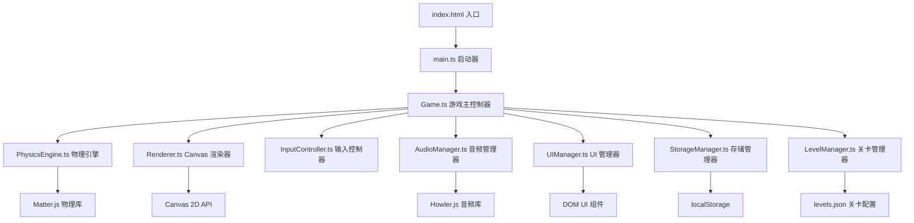

## 1. 架构设计



## 2. 技术描述

- **前端**：Vite 5 + TypeScript 5 + 原生 Canvas 2D（无框架）
- **物理引擎**：matter-js@0.19.0
- **音频库**：howler@2.2.4
- **构建工具**：Vite 5
- **类型系统**：TypeScript 5
- **样式**：原生 CSS 变量 + CSS 动画
- **存储**：localStorage
- **PWA**：Vite PWA 插件

## 3. 目录结构

```
src/
├── main.ts                 # 应用入口
├── Game.ts                 # 游戏主控制器（状态机）
├── types/
│   └── index.ts            # 类型定义
├── core/
│   ├── PhysicsEngine.ts    # 物理引擎封装
│   ├── Renderer.ts         # Canvas 渲染器
│   └── InputController.ts  # 输入控制
├── game/
│   ├── LevelManager.ts     # 关卡管理
│   ├── ScoreManager.ts     # 分数管理
│   └── ParticleSystem.ts   # 粒子系统
├── ui/
│   ├── UIManager.ts        # UI 管理器
│   ├── HUD.ts              # 头顶显示
│   ├── MainMenu.ts         # 主菜单
│   ├── LevelSelect.ts      # 关卡选择
│   ├── GameOver.ts         # 失败层
│   └── LevelComplete.ts    # 过关层
├── audio/
│   └── AudioManager.ts     # 音频管理
├── storage/
│   └── StorageManager.ts   # 本地存储
├── config/
│   ├── levels.json         # 关卡配置
│   └── constants.ts        # 游戏常量
├── utils/
│   └── math.ts             # 数学工具
├── style.css               # 全局样式
└── vite-env.d.ts
```

## 4. 核心类设计

### 4.1 Game 主控制器

```typescript
class Game {
  state: GameState; // MENU | PLAYING | PAUSED | GAME_OVER | LEVEL_COMPLETE
  physics: PhysicsEngine;
  renderer: Renderer;
  input: InputController;
  audio: AudioManager;
  ui: UIManager;
  storage: StorageManager;
  levels: LevelManager;
  score: ScoreManager;
  particles: ParticleSystem;

  constructor(canvas: HTMLCanvasElement);
  startLevel(levelId: number): void;
  pause(): void;
  resume(): void;
  restart(): void;
  gameOver(): void;
  levelComplete(): void;
  update(deltaTime: number): void;
  render(): void;
}
```

### 4.2 PhysicsEngine 物理引擎

```typescript
class PhysicsEngine {
  engine: Matter.Engine;
  world: Matter.World;
  runner: Matter.Runner;
  ringBodies: Matter.Body[];
  balls: Matter.Body[];

  createRing(radius: number, thickness: number, gaps: Gap[]): void;
  createBall(x: number, y: number, radius: number, color: string): Matter.Body;
  applyTangentialForce(ball: Matter.Body, force: number, direction: number): void;
  checkFailure(): FailureInfo | null;
  updateGapRotation(angle: number): void;
  onCollision(callback: (event: CollisionEvent) => void): void;
}
```

### 4.3 Renderer 渲染器

```typescript
class Renderer {
  ctx: CanvasRenderingContext2D;
  dpr: number;
  width: number;
  height: number;
  centerX: number;
  centerY: number;

  resize(): void;
  clear(): void;
  drawRing(radius: number, thickness: number, gaps: Gap[], pulseIntensity: number): void;
  drawBall(ball: BallData, trail: TrailPoint[]): void;
  drawParticles(particles: Particle[]): void;
  drawComboText(text: string, x: number, y: number): void;
}
```

### 4.4 LevelManager 关卡管理

```typescript
class LevelManager {
  levels: LevelConfig[];
  currentLevel: LevelConfig | null;
  unlockedLevel: number;

  loadLevels(): Promise<void>;
  getLevel(id: number): LevelConfig;
  unlockNextLevel(): void;
  isUnlocked(id: number): boolean;
}
```

### 4.5 关卡配置类型

```typescript
type GoalType = 'SURVIVE' | 'HITS' | 'HYBRID';

interface GapConfig {
  startAngle: number;
  angleWidth: number;
  rotationSpeed?: number;
}

interface LevelConfig {
  id: number;
  name: string;
  ballCount: number;
  ringRadius: 'small' | 'medium' | 'large';
  gaps: GapConfig[];
  restitution: number;
  friction: number;
  frictionAir: number;
  goal: {
    type: GoalType;
    surviveSeconds?: number;
    hitCount?: number;
  };
  forceMultiplier: number;
  targetAllBalls: boolean;
}
```

## 5. 核心算法

### 5.1 失败判定算法

```typescript
// 规则 A：球心越过内边界且角度落在缺口弧段内
function checkRuleA(ball: Matter.Body, ringRadius: number, thickness: number, gaps: Gap[]): boolean {
  const dx = ball.position.x - centerX;
  const dy = ball.position.y - centerY;
  const distance = Math.sqrt(dx * dx + dy * dy);
  const innerRadius = ringRadius - thickness;
  
  if (distance > innerRadius) {
    const angle = Math.atan2(dy, dx);
    return gaps.some(gap => isAngleInGap(angle, gap));
  }
  return false;
}

// 规则 B：球心到圆心距离 > R - t - r（兜底）
function checkRuleB(ball: Matter.Body, ringRadius: number, thickness: number, ballRadius: number): boolean {
  const dx = ball.position.x - centerX;
  const dy = ball.position.y - centerY;
  const distance = Math.sqrt(dx * dx + dy * dy);
  return distance > ringRadius - thickness - ballRadius;
}
```

### 5.2 切向力施加算法

```typescript
function applyTangentialForce(
  ball: Matter.Body,
  dragStart: { x: number; y: number },
  dragEnd: { x: number; y: number },
  center: { x: number; y: number },
  forceMultiplier: number
): void {
  // 计算球相对于圆心的角度
  const ballAngle = Math.atan2(
    ball.position.y - center.y,
    ball.position.x - center.x
  );
  
  // 计算拖动方向的切向分量
  const dragDx = dragEnd.x - dragStart.x;
  const dragDy = dragEnd.y - dragStart.y;
  const dragDistance = Math.sqrt(dragDx * dragDx + dragDy * dragDy);
  
  // 切向方向（垂直于径向）
  const tangentX = -Math.sin(ballAngle);
  const tangentY = Math.cos(ballAngle);
  
  // 计算拖动在切向的投影
  const tangentialComponent = dragDx * tangentX + dragDy * tangentY;
  
  // 施加力
  const forceMagnitude = tangentialComponent * forceMultiplier;
  Matter.Body.applyForce(ball, ball.position, {
    x: tangentX * forceMagnitude,
    y: tangentY * forceMagnitude
  });
}
```

### 5.3 Combo 判定

```typescript
class ComboSystem {
  private hits: { timestamp: number }[] = [];
  private comboWindow = 2000; // 2s
  private maxCombo = 3;

  addHit(): number {
    const now = Date.now();
    this.hits.push({ timestamp: now });
    // 移除窗口外的碰撞
    this.hits = this.hits.filter(h => now - h.timestamp < this.comboWindow);
    // 计算 combo 倍率
    return Math.min(this.hits.length, this.maxCombo);
  }

  reset(): void {
    this.hits = [];
  }

  getMultiplier(): number {
    return Math.min(this.hits.length, this.maxCombo);
  }
}
```

## 6. 数据模型

### 6.1 存储数据结构

```typescript
interface GameSaveData {
  highScore: number;
  highestLevel: number;
  unlockedLevel: number;
  settings: GameSettings;
  levelScores: Record<number, number>;
}

interface GameSettings {
  soundEnabled: boolean;
  vibrationEnabled: boolean;
  musicVolume: number;
  sfxVolume: number;
}
```

### 6.2 游戏状态

```typescript
type GameState = 'MENU' | 'LEVEL_SELECT' | 'PLAYING' | 'PAUSED' | 'GAME_OVER' | 'LEVEL_COMPLETE';

interface GameStateData {
  score: number;
  combo: number;
  surviveTime: number;
  hitCount: number;
  ballsAlive: number;
}
```
